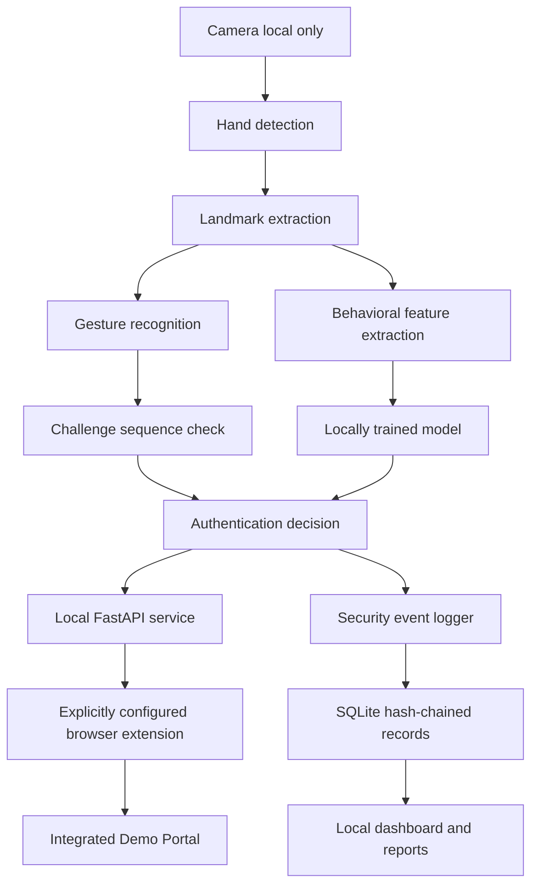

# SecureAir architecture — planned components

This diagram describes the intended system, not functionality already implemented in Stage 1.

## Boundaries

- Process camera frames locally; do not persist raw video. Persist only minimized features required for model use.
- Make challenge state random, user-bound, short-lived, and single-use. Keep gesture and behavior checks separate.
- Restrict the API to loopback and validate local requests. An extension is not a security boundary against a compromised host.
- Enforce demo portal authorization server-side; hiding UI is insufficient.
- Hash-chain canonical event records. Local administrator compromise remains a limitation.
- Log only events for domains explicitly configured by the user; never record page text, credentials, cookies, or form values.
